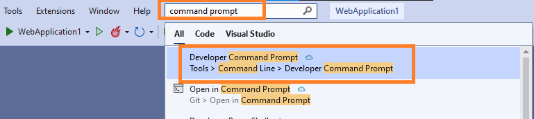
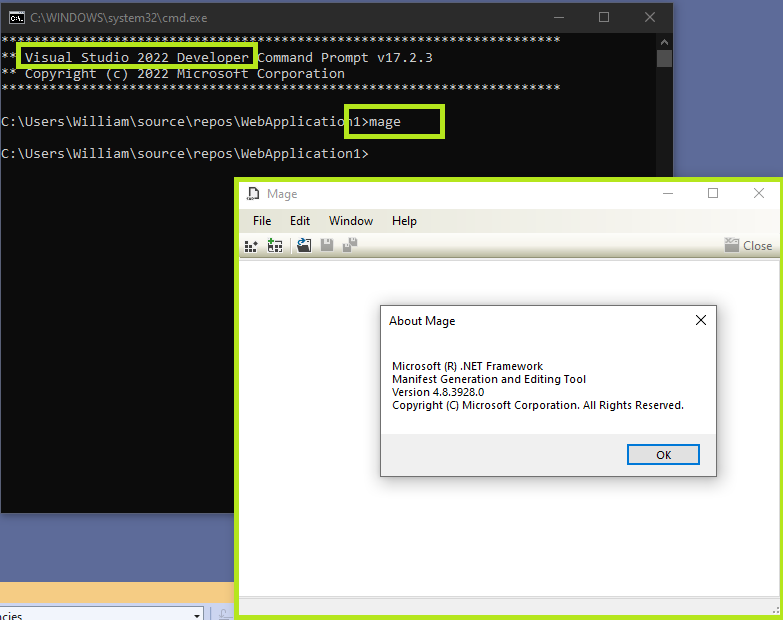
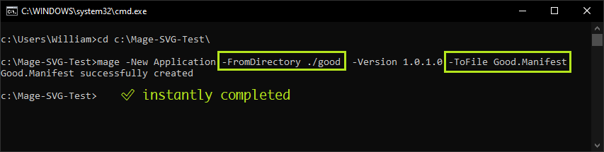
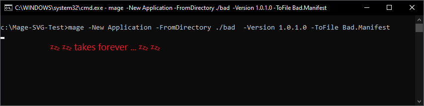
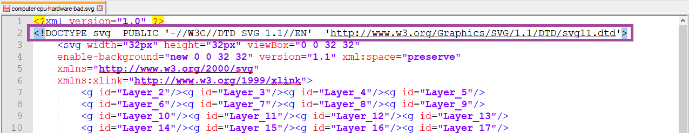
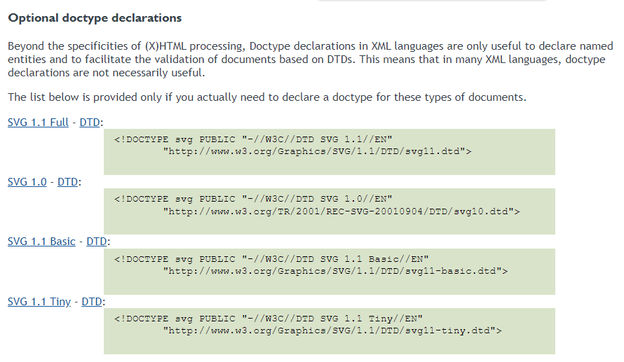
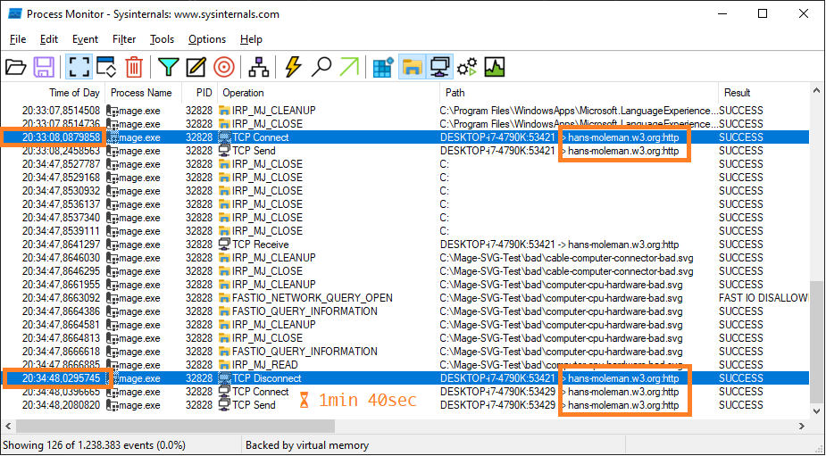
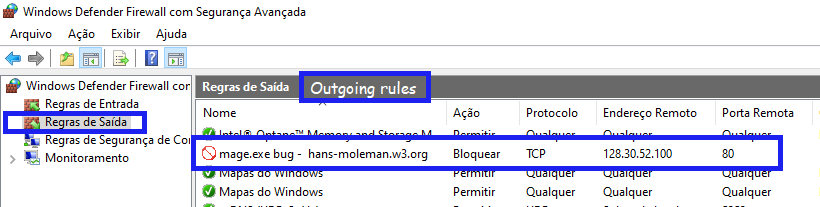

# Mage.exe bug related to SVG - and other XML - files.

## TL;DR
- `Mage.exe` is a Microsoft utility for Manifest Generation and Editing, used in Signature, Deploy and Azure DevOps Pipelines, for example.

- When the utility scans a directory to generate the manifest, it scans each file to anotate include the file, size and `hash` in the final Manifest file.

- But, if the file is a broken XML or a broken SVG (as you can see in the examples), the utility tries to validate the file against its DTD and try to connect to the internet address http://W3.ORG (mostly), which can cause a wait of more the a minute for each file. 😣

- A project with 15 broken SVG files can easily add 30 minutes to the build/delivery process time.

- Quick and dirty solution: Block http://w3.org site or IPs in the firewall of the Building Server - only need to block `port 80`

- ⚠ Is it a possible privacy/security issue?

# Steps to Reproduce
1. In Visual Studio open the Developer Command Prompt.



2. Check if `Mage.exe` is available, as well the version of Visual Studio and Mage.exe utility



3. Download the SVG examples from the folder [/examples](/examples)

4. Go back to the `Developer Command Prompt` window, change directory (CD) to the examples folder.

5. Run the command for the Good SVGs folder, and you get almost instantly a `Good.Manifest` file.

    ```mage -New Application -FromDirectory ./good  -Version 1.0.1.0 -ToFile Good.Manifest```



6. Run command for the Bad SVGs folder, take a cup of coffee and wait ☕

    ```mage -New Application -FromDirectory ./bad  -Version 1.0.1.0 -ToFile Bad.Manifest```



# What is a Good vs Bad SVG?

The files in the [/examples/bad](/examples/bad) folder have a declaration of `DOCTYPE svg PUBLIC` that causes the utility `mage.exe` to access the internet. 

The Process Monitor shows that `mage.exe` tries to open a DTD file named `-//W3C//DTD SVG 1.1//EN` that is not found, so it connects to the address which points to `w3.org`.



W3.org states that these type of declarations are valid - https://www.w3.org/QA/2002/04/valid-dtd-list.htm, so nothing really "wrong" or "bad" with the files. The problem is with the utility.



# Process Monitor helps discover the problem

With the help of `Process Monitor`, part of `SysInternals Utilities` from Microsoft, it was clear that the process is communication with the internet. And it takes about 1 minute and 40 seconds to close the connection __for each__ broken file.

Another utility from `SysInternals`, `Process Explorer` also show established connection to the w3.org server, transfering data at a really slow pace, around 20 bytes per second.



## Connection to hans-moleman.w3.org

A quick search on the internet says that `Hans Moleman` is the name of a Simpson's character. He is a extremely bad luck guy, according to Simpson's Wiki.

That server also seems to be out of luck, since every bad XML/SVG file processed by `Mage.exe` can cause a connectino to it. That's the reason I think `w3.org` decided to keep the server up, but with a very low bandwidth for every connection, because some projects may act like real `DDoS attacks` couple times each day.


# Quick fix on the Firewall

Until someone finds another fix, the quicker solution was to add an outgoing rule in the Windows Server firewall.

  a) you can block the process `mage.exe` (in my computer, located at `C:\Program Files (x86)\Microsoft SDKs\Windows\v10.0A\bin\NETFX 4.8 Tools`)
  
  b) block the IP address of `hans-moleman.w3.org` (`128.30.52.100`), just port 80.




# Security Issue ⚠

An SVG file seems to be harmless, but imagine someone adding a link to other sites than w3.org. Which kind of tracking information they will be able to get? Is it possible to explore XML External Entities (XXE) injection?

# Considerations

Since `Mage.exe` is a tool to generate and edit manifests - which are also XML files, somehow its important for it to validate XMLs. But, when doing generating the hash on the files it is not suppose for it to validate them, just check the bytes.

# References: 
Good Files from: https://github.com/microsoft/PowerBI-Icons/blob/main/SVG/Discover.svg

Bad Files from: https://www.svgrepo.com/collection/computer-and-hardware-duotone-icons/

Mage.exe official page:
https://docs.microsoft.com/en-us/dotnet/framework/tools/mage-exe-manifest-generation-and-editing-tool

SysInternals - [Process Monitor](https://docs.microsoft.com/en-us/sysinternals/downloads/procmon)

SysInternals - [Process Explorer](https://docs.microsoft.com/en-us/sysinternals/downloads/process-explorer)

Simpson's Fandom Wikipedia - https://simpsons.fandom.com/wiki/Hans_Moleman

XML External Entities (XXE) Explained - https://www.youtube.com/watch?v=gjm6VHZa_8s

# Thanks

👍 Thanks to C. Alfonso for helping me get directly to the possible cause of the problem